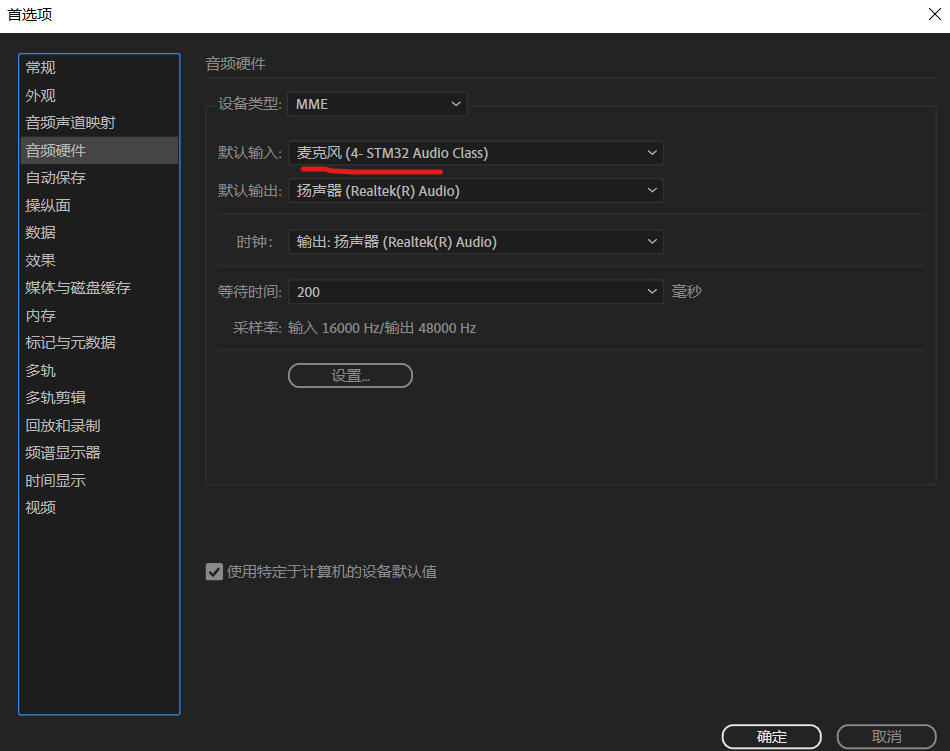
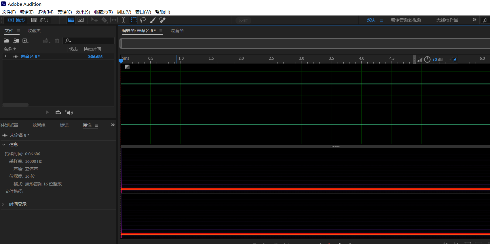
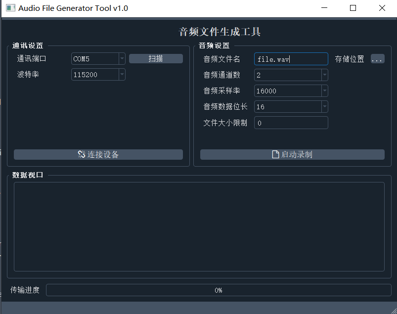

# Audio_File_Generator_MCU_Code

平台：STM32F407VET6

音频编辑工具：[Adobe Audition 2021](https://www.jb51.net/softs/768000.html)

支持两种音频导出，第二种依赖PC端工具

- USB音频麦克风
- USBCDC串口

**USB方式**

连接USB到PC端，会有一个麦克风硬件：

录制即可导出实时音频

# PC端工具

**[工具下载](https://github.com/aron566/Audio_File_Generator)**

